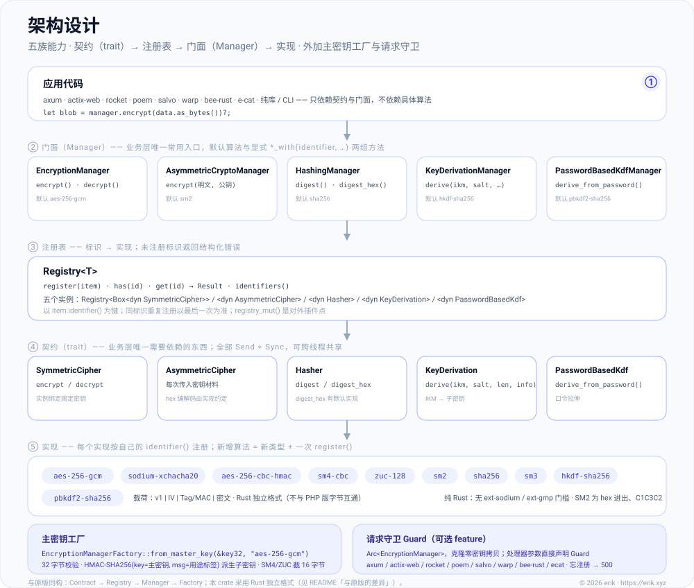
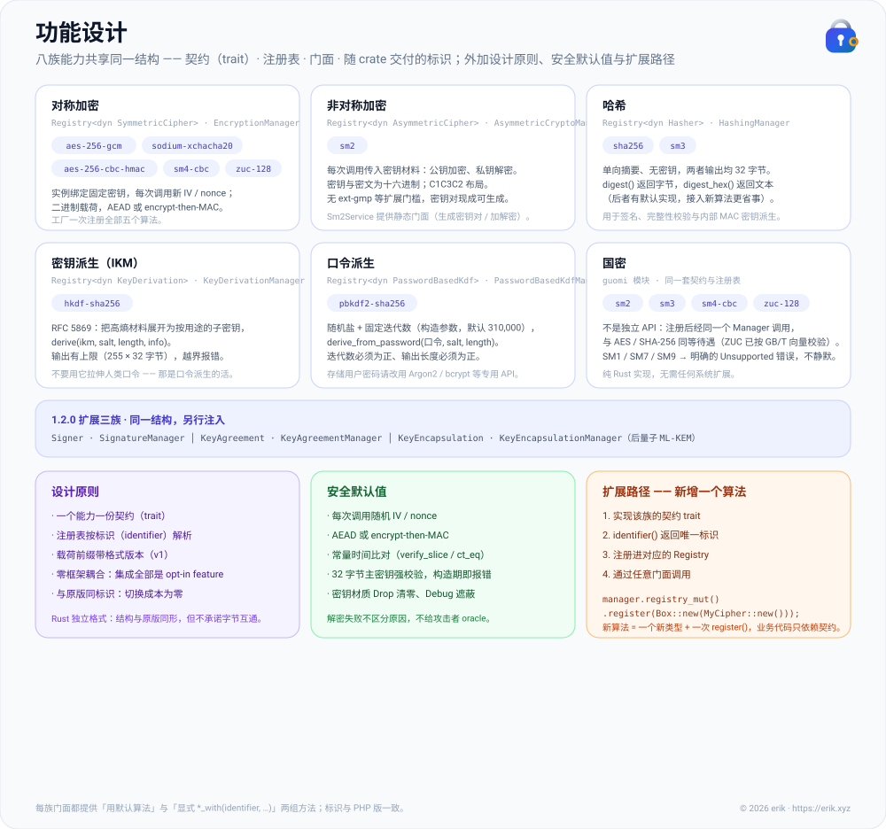
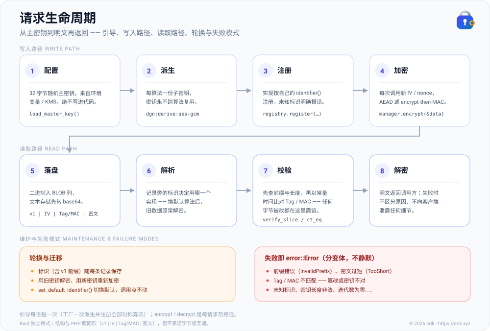

<!-- Copyright (c) 2026 erik <erik@erik.xyz> — https://erik.xyz -->

# encryption-rust

[](https://crates.io/crates/encryption-rust)
[](https://docs.rs/encryption-rust)
[](https://github.com/erikwang2013/encryption-rust/actions/workflows/ci.yml)
[](./LICENSE)

**语言 / Languages:** **简体中文** | [English](./docs/i18n/en/README.md)

<p align="center">
  
</p>

可插拔密码学组件库：在统一契约下提供**对称加密**、**非对称加密**、**哈希**、**密钥派生**（HKDF / PBKDF2），并包含 AES/Sodium、国密 SM2/SM3/SM4/ZUC 等实现，通过 Cargo 安装。

**Locky** 就是上面这只小锁，也是本项目的宠物：每个算法各持一把子密钥，每次加密都用新的 IV，钥匙孔从不泄露秘密。宿主项目也可以展示它：`pet::SVG` 返回 SVG 内容（可内联进 HTML），`pet::ASCII` 返回终端横幅，`pet::NAME` 即 `Locky`。

Rust 移植自 PHP 包 [`erikwang2013/encryption`](https://github.com/erikwang2013/encryption)。

---

## 项目宠物：Locky


一只握着金钥匙的小锁。人设不是装饰，是把本库的设计画出来了：

| 形象 | 对应设计 |
|------|---------|
| 锁孔（微笑） | Key / IV 纪律：钥匙孔从不透露自己见过什么，密钥与明文从不外泄 |
| 另一只手的金色钥匙 | 主密钥：`EncryptionManagerFactory::from_master_key` 从它派生各算法子密钥 |
| 一把锁只认自己的钥匙 | 认证加密：GCM / encrypt-then-MAC 解不开就是密钥不对或密文被改，没有第三种解释 |
| 每算法一份子密钥 | 同一主密钥下 AES 与 SM4/ZUC 互不共用密钥材料，避免密钥复用 |

座右铭：**钥匙孔从不泄露秘密。**

形象以 `include_str!` 打进库里（[`src/pet.rs`](./src/pet.rs)，零运行时开销，不用就不链接），`pet::ASCII` 可直接打进终端或日志：

```rust
use encryption::pet;

println!("{}", pet::ASCII);

//      .-------.
//      /       \
//   .-------------.
//   |  o       o  |
//   |             |
//   |     ,-.     |
//   |    (   )    |
//   |     '-'     |
//   |      |      |
//   '-------------'
```

`pet::NAME` / `pet::TAGLINE` / `pet::ASCII` / `pet::SVG` 四个常量对外公开，README、CLI banner、下游管理界面共用同一份。

宠物的整合点不止 README：**三张设计图右上角各有一枚 Locky 小图标**（纯内联 SVG，GitHub 上直接渲染），[`docs/social-preview.svg`](./docs/social-preview.svg) / `social-preview.png` 是宠物主视觉的 GitHub 社交预览图（1280×640，上传到仓库设置即可）。

`docs/pet.svg` **不能**进 Cargo 的 `exclude` —— `include_str!` 在编译期读它，排掉就当场编译失败（`cargo package` 会直接报错，不会静默漏发）。

---

## 项目说明

### 这是什么

`encryption-rust` 是一个纯 Rust 密码学组件库，为 Rust 应用提供**类型安全、可扩展**的加解密、哈希与密钥派生能力。它不与任何框架耦合，可在 axum、actix-web 等 Web 框架，或纯库、CLI 项目中独立使用。

### 解决什么问题

Rust 生态中密码学实现长期分散：AES 用 `aes-gcm`、流密码用 `chacha20poly1305`、国密散落在 sm2 / sm3 / sm4 / zuc 等各自独立的 crate，HKDF / PBKDF2 缺少统一接口。本库在**单一契约体系**下收敛了主流对称 / 非对称 / 哈希 / KDF 算法，使得：

- **业务层只需面对接口**，切换算法不改业务代码
- **国密与 AES/Sodium 同等待遇**，注册后通过同一 Manager 调用
- **密钥管理规范化**：一键从主密钥派生各算法子密钥，避免密钥复用
- **安全默认值**：认证加密（GCM / encrypt-then-MAC）、随机 IV、常量时间比较等开箱即用

### 适用场景

- 字段级加解密（手机号、身份证号等敏感字段入库前加密）
- 多算法并存与平滑迁移（如从 AES-256-CBC 迁移到 AES-256-GCM）
- 需要国密合规的中后台系统（SM2 非对称、SM3 哈希、SM4 对称、ZUC 流密码）
- API 签名与验证（HMAC / SHA-256 / SM3）
- 基于口令或主密钥的子密钥派生（PBKDF2 / HKDF）

---

## 项目功能

- **八族能力，一套结构**：对称加密 / 非对称加密 / 哈希 / 密钥派生 / 口令派生 / 签名 / 密钥协商 / 密钥封装 —— 每族都是「契约（trait）→ 注册表（Registry）→ 门面（Manager）」的同一形状，学会一族就会全部。
- **十个开箱标识**：`aes-256-gcm`、`sodium-xchacha20`、`aes-256-cbc-hmac`、`sm4-cbc`、`zuc-128`、`sm2`、`sha256`、`sm3`、`hkdf-sha256`、`pbkdf2-sha256`（与 PHP 版标识一致，迁移零改名成本）。
- **扩展算法面（1.2.0）**：工厂默认集之外另有 30 余个扩展标识——对称 9、哈希 8、口令派生 2、非对称 1、签名 5（含 SM2 签名能力）、密钥协商 4、密钥封装 3（ML-KEM 后量子）；全部手动注册，工厂与 PHP 对齐面不受影响。
- **主密钥工厂**：`EncryptionManagerFactory::from_master_key` —— 一把 32 字节主密钥按用途标签派生各算法独立子密钥，一次装配全部算法，杜绝密钥复用。
- **请求守卫 Guard + 框架适配**：原生 Rust 与 axum / actix-web / rocket / poem / salvo / warp / bee-rust / e-cat 共 8 个 opt-in feature；处理器参数直接声明 `Guard` 即可加解密。
- **国密一等公民**：SM2 / SM3 / SM4 / ZUC 与 AES / SHA 走同一条注册-门面链路；SM1 / SM7 / SM9 给出明确错误而非静默。
- **安全默认值**：随机 IV / nonce、AEAD 或 encrypt-then-MAC、常量时间比对、密钥材质 Drop 清零、Debug 遮蔽、解密失败不区分原因。
- **纯 Rust、零扩展依赖**：没有 `ext-sodium` / `ext-gmp` 之类门槛；ZUC 已经 GB/T 33133.1 标准向量校验。
- **文档即设计图**：架构设计 / 功能设计 / 请求生命周期三张 SVG（中英文各一份），加上宠物 Locky。
- **零框架耦合**：核心库不依赖任何 Web 框架，框架集成全部可选、默认一个都不拉。

> 完整能力地图见下文[功能设计](#功能设计)，分层结构见[架构概览](#架构概览)。

## 目录

- [安装](#安装)
- [快速开始](#快速开始)
- [架构概览](#架构概览)
- [功能设计](#功能设计)
- [请求生命周期](#请求生命周期)
- [内置算法与标识](#内置算法与标识)
- [使用说明](#使用说明)
- [框架集成（可选 feature）](#框架集成可选-feature)
- [与原版的差异](#与原版的差异)
- [项目目录](#项目目录)
- [常见问题](#常见问题)
- [安全建议](#安全建议)
- [运行测试](#运行测试)
- [参考原项目](#参考原项目)
- [许可证](#许可证)

---

## 安装

```bash
cargo add encryption-rust
```

```toml
[dependencies]
encryption-rust = "1.0"
```

## 快速开始

```rust
use encryption::factory::EncryptionManagerFactory;

// 生产环境请从环境变量 / KMS 读取随机 32 字节主密钥，并妥善备份。
let master_key: [u8; 32] = load_master_key();
let manager = EncryptionManagerFactory::from_master_key(&master_key, "aes-256-gcm")?;

// 字段级加密：密文是二进制，存 TEXT 列时自行 base64 / hex。
let stored = manager.encrypt(phone.as_bytes())?;
let phone = manager.decrypt(&stored)?;
```

完整可运行版本见 [`examples/quickstart.rs`](./examples/quickstart.rs)：`cargo run --example quickstart` 会打印宠物 ASCII、加密 → 转文本 → 解密 → 篡改检测的完整往返。

## 架构概览



图源文件：[`docs/architecture-design.svg`](./docs/architecture-design.svg)

能力被拆成八组契约，每组一套「契约（trait）→ 注册表（Registry）→ 门面（Manager）」；`EncryptionManagerFactory` 从一把主密钥派生全部子密钥并装配对称注册表。

| 能力 | 契约（trait） | 注册表 | 门面（默认算法） |
|------|--------------|--------|------------------|
| 对称加密 | `SymmetricCipher` | `Registry<Box<dyn SymmetricCipher>>` | `EncryptionManager`（`aes-256-gcm`） |
| 非对称加密 | `AsymmetricCipher` | `Registry<Box<dyn AsymmetricCipher>>` | `AsymmetricCryptoManager`（`sm2`） |
| 哈希 | `Hasher` | `Registry<Box<dyn Hasher>>` | `HashingManager`（`sha256`） |
| 密钥派生（IKM） | `KeyDerivation` | `Registry<Box<dyn KeyDerivation>>` | `KeyDerivationManager`（`hkdf-sha256`） |
| 口令派生 | `PasswordBasedKdf` | `Registry<Box<dyn PasswordBasedKdf>>` | `PasswordBasedKdfManager`（`pbkdf2-sha256`） |
| 签名 | `Signer` | `Registry<Box<dyn Signer>>` | `SignatureManager`（默认标识由构造传入，示例 `ed25519`） |
| 密钥协商 | `KeyAgreement` | `Registry<Box<dyn KeyAgreement>>` | `KeyAgreementManager`（示例 `x25519`） |
| 密钥封装 | `KeyEncapsulation` | `Registry<Box<dyn KeyEncapsulation>>` | `KeyEncapsulationManager`（示例 `ml-kem-768`） |

- **对称**：实例绑定固定密钥；载荷为二进制，适合字段级批量加密。
- **非对称**：每次调用传入密钥材料（十六进制，格式由实现约定，如 SM2）。
- **哈希**：单向摘要，无密钥；`digest` 返回字节，`digest_hex` 返回十六进制。
- **密钥派生**：HKDF 把高熵材料展开为子密钥；PBKDF2 拉伸人类口令（随机盐 + 高迭代数）。
- **子密钥**：`HMAC-SHA256(key = 主密钥, msg = 用途标签)`；SM4 / ZUC 取前 16 字节。
- **八个契约全部 `Send + Sync`**：实现可跨线程共享，请求守卫得以零密钥拷贝地克隆。
- **签名 / 协商 / 封装**：密钥与结果一律十六进制字符串；ML-KEM 解封装遇到被篡改密文按 FIPS 203 隐式拒绝——不报错，返回与封装端不同的伪随机密钥。

## 功能设计



图源文件：[`docs/functional-design.svg`](./docs/functional-design.svg)

| 能力族 | 门面 | 随 crate 交付的标识 |
|--------|------|---------------------|
| 对称加密 | `EncryptionManager` | 工厂默认 5 个：`aes-256-gcm` / `sodium-xchacha20` / `aes-256-cbc-hmac` / `sm4-cbc` / `zuc-128`；扩展 9 个：`chacha20-poly1305-ietf` / `aes-256-gcm-siv` / `camellia-256-cbc-hmac` / `aria-256-cbc-hmac` / `threefish-512-cbc-hmac` / `kuznyechik-256-cbc-hmac` / `salsa20` / `sm4-gcm` / `zuc-256` |
| 非对称加密 | `AsymmetricCryptoManager` | `sm2`（另有静态门面 `Sm2Service`）；扩展：`rsa-oaep-sha256` |
| 哈希 | `HashingManager` | `sha256` / `sm3`；扩展：`sha3-256` / `sha3-512` / `blake2b-512` / `blake2s-256` / `blake3` / `streebog-256` / `streebog-512` / `belt-hash` |
| 密钥派生（IKM） | `KeyDerivationManager` | `hkdf-sha256`（RFC 5869） |
| 口令派生 | `PasswordBasedKdfManager` | `pbkdf2-sha256`（默认 310,000 次迭代）；扩展：`argon2` / `scrypt` |
| 签名 | `SignatureManager` | `sm2`（签名能力）/ `ed25519` / `ecdsa-p256-sha256` / `ecdsa-p384-sha384` / `ecdsa-secp256k1-sha256` |
| 密钥协商 | `KeyAgreementManager` | `x25519` / `ecdh-p256` / `ecdh-p384` / `ecdh-secp256k1` |
| 密钥封装（后量子） | `KeyEncapsulationManager` | `ml-kem-512` / `ml-kem-768` / `ml-kem-1024`（FIPS 203） |
| 国密 | 同上各门面 | `sm2`（加解密 + 签名）/ `sm3` / `sm4-cbc` / `zuc-128`；扩展 `sm4-gcm` / `zuc-256`；SM1 / SM7 / SM9 → 明确错误 |

设计原则、安全默认值与「新增一个算法」的四步路径见上图右侧三块；每个算法的细节（密钥长度、载荷结构）见下文[内置算法与标识](#内置算法与标识)。

## 请求生命周期



图源文件：[`docs/lifecycle.svg`](./docs/lifecycle.svg)

写入路径（每进程引导一次，随后的 encrypt / decrypt 是每请求热路径）：

1. **配置**：32 字节随机主密钥来自环境变量 / KMS，绝不写进代码；
2. **派生**：工厂按用途标签为每个算法派生子密钥，密钥永不跨算法复用；
3. **注册**：实现按自己的 `identifier()` 注册进注册表，未知标识明确报错；
4. **加密**：每次调用生成新的随机 IV / nonce，认证加密或 encrypt-then-MAC 打包为 `v1 | IV | Tag/MAC | 密文`。

读取路径：

5. **落盘**：二进制入 BLOB 列，文本存储先转 base64；
6. **解析**：记录旁的标识决定用哪个实现 —— 切换默认算法后旧数据照常解密；
7. **校验**：先查前缀与长度，再以常量时间比对 Tag / MAC，任何字节被改都在这里露馅；
8. **解密**：明文返回调用方；失败时不区分原因、不向客户端泄露任何细节。

密钥轮换、迁移与全部失败变体见图中底部的「维护与失败模式」。

## 内置算法与标识

### 对称加密（`SymmetricCipher`）

| 标识 | 类型 | 密钥长度 | 载荷 |
|------|------|----------|------|
| `aes-256-gcm` | `Aes256GcmEncryptor` | 32 字节 | `v1 \| IV(12) \| Tag(16) \| 密文`，AES-GCM 认证加密，推荐默认 |
| `sodium-xchacha20` | `SodiumXChaCha20Encryptor` | 32 字节 | `v1 \| Nonce(24) \| 密文‖Tag(16)`，XChaCha20-Poly1305，纯 Rust、恒可用 |
| `aes-256-cbc-hmac` | `Aes256CbcEncryptor` | 32 字节 | `v1 \| IV(16) \| MAC(32) \| 密文`，CBC + HMAC，兼容旧环境 |
| `sm4-cbc` | `Sm4CbcEncryptor` | 16 字节 | 同 CBC-HMAC 结构，国密 SM4 |
| `zuc-128` | `Zuc128Encryptor` | 16 字节 | 同 CBC-HMAC 结构，ZUC-128 流密码与密钥流异或 |
| `chacha20-poly1305-ietf` | `ChaCha20Poly1305IetfEncryptor` | 32 字节 | `v1 \| Nonce(12) \| Tag(16) \| 密文`，IETF ChaCha20-Poly1305（RFC 8439），无 AES 硬件依赖 |
| `aes-256-gcm-siv` | `Aes256GcmSivEncryptor` | 32 字节 | 同上帧结构，AES-256-GCM-SIV（RFC 8452）误用稳健 AEAD，nonce 复用不致命 |
| `camellia-256-cbc-hmac` | `Camellia256CbcEncryptor` | 32 字节 | 同 CBC-HMAC 结构，Camellia-256（ISO/IEC 18033-3） |
| `aria-256-cbc-hmac` | `Aria256CbcEncryptor` | 32 字节 | 同 CBC-HMAC 结构，ARIA-256（RFC 5794） |
| `threefish-512-cbc-hmac` | `Threefish512CbcEncryptor` | 64 字节 | `v1 \| IV(64) \| MAC(32) \| 密文`，Threefish-512（块与 IV 均 64 字节） |
| `kuznyechik-256-cbc-hmac` | `Kuznyechik256CbcEncryptor` | 32 字节 | 同 CBC-HMAC 结构，Kuznyechik（GOST R 34.12-2015，密钥固定 256 位） |
| `salsa20` | `Salsa20Encryptor` | 32 字节 | `v1 \| Nonce(8) \| MAC(32) \| 密文`，Salsa20/20 流密码与密钥流异或 |
| `sm4-gcm` | `Sm4GcmEncryptor` | 16 字节 | `v1 \| Nonce(12) \| Tag(16) \| 密文`，SM4 + GCM 组装（RFC 8998 向量锚定） |
| `zuc-256` | `Zuc256Encryptor` | 32 字节 | `v1 \| IV(23) \| MAC(32) \| 密文`，ZUC-256 流密码（32 字节密钥 / 23 字节 IV） |

> 前五行由主密钥工厂默认注册；其余为本批扩展实现（手动 `register`，不进工厂）。

### 非对称加密（`AsymmetricCipher`）

| 标识 | 类型 | 说明 |
|------|------|------|
| `sm2` | `Sm2AsymmetricCipher` / `Sm2Service` | 国密 SM2；密钥与密文为十六进制，密文布局 C1C3C2 |
| `rsa-oaep-sha256` | `RsaOaepSha256Cipher` | RSAES-OAEP（摘要与 MGF1 均 SHA-256）；私钥 PKCS#8 DER / 公钥 SPKI DER 的十六进制；`generate_key_pair_hex` 拒绝 < 2048 位 |

### 哈希（`Hasher`）

| 标识 | 类型 | 输出长度 |
|------|------|----------|
| `sha256` | `Sha256Hasher` | 32 字节 |
| `sm3` | `Sm3Hasher` | 32 字节 |
| `sha3-256` | `Sha3_256Hasher` | 32 字节 |
| `sha3-512` | `Sha3_512Hasher` | 64 字节 |
| `blake2b-512` | `Blake2b512Hasher` | 64 字节 |
| `blake2s-256` | `Blake2s256Hasher` | 32 字节 |
| `blake3` | `Blake3Hasher` | 32 字节（默认输出；BLAKE3 支持扩展输出，本库走默认长度） |
| `streebog-256` | `Streebog256Hasher` | 32 字节 |
| `streebog-512` | `Streebog512Hasher` | 64 字节 |
| `belt-hash` | `BeltHashHasher` | 32 字节 |

### 密钥派生

| 标识 | 类型 | 契约 | 说明 |
|------|------|------|------|
| `hkdf-sha256` | `HkdfSha256` | `KeyDerivation` | RFC 5869，基于 IKM + salt + info |
| `pbkdf2-sha256` | `Pbkdf2Sha256` | `PasswordBasedKdf` | 口令 + 盐 + 迭代次数（默认 310,000，构造参数可调） |
| `argon2` | `Argon2Kdf` | `PasswordBasedKdf` | Argon2id v19；默认 m=19456 KiB（约 19 MiB）/ t=2 / p=1，`with_params` 可调 |
| `scrypt` | `ScryptKdf` | `PasswordBasedKdf` | 默认 log_n=17、r=8、p=1（约 128 MiB/次——Web 场景注意 DoS 面，`with_params` 可调） |

### 签名（`Signer`）

| 标识 | 类型 | 说明 |
|------|------|------|
| `sm2` | `Sm2Signer` | SM2 签名 / 验签；ZA 默认用户 ID `1234567812345678`（GM/T 0003.2），**验签方必须使用同一 ID** |
| `ed25519` | `Ed25519Signer` | RFC 8032；私钥 32 字节 seed hex，签名 64 字节定长 |
| `ecdsa-p256-sha256` | `EcdsaP256Signer` | RFC 6979 确定性签名；私钥裸标量 hex，公钥 SEC1 非压缩 `04‖X‖Y`，签名定长 `r‖s` |
| `ecdsa-p384-sha384` | `EcdsaP384Signer` | 同上（P-384 / SHA-384，签名 96 字节） |
| `ecdsa-secp256k1-sha256` | `EcdsaSecp256k1Signer` | 同上（secp256k1；RFC 6979 未收录该曲线向量，KAT 退化为行为测试） |

### 密钥协商（`KeyAgreement`）

| 标识 | 类型 | 说明 |
|------|------|------|
| `x25519` | `X25519Agreement` | RFC 7748；拒绝小阶点导致的全零共享秘密 |
| `ecdh-p256` / `ecdh-p384` / `ecdh-secp256k1` | `EcdhP256` / `EcdhP384` / `EcdhSecp256k1` | 静态 ECDH；共享秘密为原始 x 坐标 hex |

### 密钥封装（`KeyEncapsulation`，后量子）

| 标识 | 类型 | 公钥 ek | 私钥 dk | 密文 ct |
|------|------|---------|---------|---------|
| `ml-kem-512` | `MlKem512Kem` | 800 字节 | 1632 字节 | 768 字节 |
| `ml-kem-768` | `MlKem768Kem` | 1184 字节 | 2400 字节 | 1088 字节 |
| `ml-kem-1024` | `MlKem1024Kem` | 1568 字节 | 3168 字节 | 1568 字节 |

FIPS 203（ML-KEM）密钥封装：公钥封装 → `(密文, 共享密钥)`（共享密钥 32 字节），私钥解封装 → 共享密钥；均十六进制。密文被篡改或私钥不配对时按标准的**隐式拒绝**语义处理：不报错，返回与封装端不同的伪随机密钥。

SM1、SM7、SM9 不提供实现：调用 `guomi::unavailable::sm1()` 等会得到明确的 `UnsupportedNationalAlgorithm` 错误，便于业务层统一捕获或接入厂商 SDK / 加密机。

## 使用说明

### 1. 对称加密：单算法与注册表

```rust
use encryption::encryptor::Aes256GcmEncryptor;
use encryption::manager::EncryptionManager;
use encryption::registry::Registry;
use encryption::contract::SymmetricCipher;

// 单算法
let key = [7u8; 32];
let encryptor = Aes256GcmEncryptor::new(key);
let blob = encryptor.encrypt(b"\xe6\x98\x8e\xe6\x96\x87")?;
let plaintext = encryptor.decrypt(&blob)?;

// 注册表 + 门面
let mut registry = Registry::new("symmetric cipher");
registry.register(Box::new(encryptor));
let manager = EncryptionManager::new(registry, "aes-256-gcm")?;
let blob = manager.encrypt(b"\xe6\x95\xb0\xe6\x8d\xae")?;
```

主密钥工厂：`EncryptionManagerFactory::from_master_key(&master_key32, "aes-256-gcm")` 一次注册 **aes-256-gcm**、**aes-256-cbc-hmac**、**sodium-xchacha20**、**sm4-cbc**、**zuc-128** 五个算法，各用按用途标签派生的独立子密钥。

### 2. 非对称加密（SM2）

```rust
use encryption::guomi::{Sm2AsymmetricCipher, Sm2Service};
use encryption::manager::AsymmetricCryptoManager;
use encryption::registry::Registry;

let pair = Sm2Service::generate_key_pair_hex()?;   // 私钥 64 位 hex，公钥 130 位 hex（04‖X‖Y）

let cipher = Sm2AsymmetricCipher::new();
let ciphertext_hex = cipher.encrypt(b"\xe6\x98\x8e\xe6\x96\x87", &pair.public_key_hex)?;
let plaintext = cipher.decrypt(&ciphertext_hex, &pair.private_key_hex)?;

let mut registry = Registry::new("asymmetric cipher");
registry.register(Box::new(cipher));
let manager = AsymmetricCryptoManager::new(registry, "sm2")?;
let ciphertext_hex = manager.encrypt(b"\xe6\x98\x8e\xe6\x96\x87", &pair.public_key_hex)?;
```

公钥接受 130 位（`04‖X‖Y`）、128 位（`X‖Y`，自动补 `04`）与 66 位（压缩点）三种十六进制写法。

### 3. 哈希

```rust
use encryption::guomi::Sm3Hasher;
use encryption::hash::Sha256Hasher;
use encryption::manager::HashingManager;
use encryption::registry::Registry;

let mut registry = Registry::new("hasher");
registry.register(Box::new(Sha256Hasher::new()));
registry.register(Box::new(Sm3Hasher::new()));

let hashing = HashingManager::new(registry, "sha256")?;
let digest = hashing.digest(b"\xe6\x95\xb0\xe6\x8d\xae")?;         // 32 字节
let hex = hashing.digest_hex_with("sm3", b"\xe6\x95\xb0\xe6\x8d\xae")?; // 十六进制
```

### 4. 密钥派生（HKDF / PBKDF2）

```rust
use encryption::kdf::{HkdfSha256, Pbkdf2Sha256};
use encryption::manager::{KeyDerivationManager, PasswordBasedKdfManager};
use encryption::registry::Registry;

// 从高熵材料派生子密钥（如信封加密中的子密钥）
let hkdf = HkdfSha256::new();
let sub_key = hkdf.derive(&ikm32, &salt, 32, b"app:v1")?;

let mut registry = Registry::new("key derivation");
registry.register(Box::new(hkdf));
let kdf = KeyDerivationManager::new(registry, "hkdf-sha256")?;

// 从用户口令派生密钥（存储密码哈希请改用 Argon2 等专用 API）
let pbkdf2 = Pbkdf2Sha256::with_default_iterations();   // 310,000 次，可 new(n) 调整
let derived = pbkdf2.derive_from_password(b"\xe5\x8f\xa3\xe4\xbb\xa4", &salt16, 32)?;

let mut registry = Registry::new("password-based kdf");
registry.register(Box::new(pbkdf2));
let pwd = PasswordBasedKdfManager::new(registry, "pbkdf2-sha256")?;
```

### 5. 国密（SM3 / SM4 / ZUC / SM2）

```rust
use encryption::guomi::{Sm2Service, Sm3Hasher, Sm4CbcEncryptor, Zuc128Encryptor};
use encryption::contract::{Hasher, SymmetricCipher};

let digest = Sm3Hasher::new().digest(b"\xe6\x95\xb0\xe6\x8d\xae")?;

let sm4 = Sm4CbcEncryptor::new([1u8; 16]);
let blob = sm4.encrypt(b"\xe6\x98\x8e\xe6\x96\x87")?;

let zuc = Zuc128Encryptor::new([2u8; 16]);
let blob = zuc.encrypt(b"\xe6\x98\x8e\xe6\x96\x87")?;

// SM2 见上文非对称示例。
```

### 6. 自定义插件

实现对应契约再注册即可，其余逻辑（门面、默认算法切换、错误语义）全部复用：

- 对称：实现 `SymmetricCipher`，注册到对称注册表；
- 非对称：实现 `AsymmetricCipher`，注册到非对称注册表；
- 哈希：实现 `Hasher`（只需实现 `digest`，`digest_hex` 有默认实现）；
- KDF：实现 `KeyDerivation` 或 `PasswordBasedKdf`，注册到对应注册表。

```rust
use encryption::contract::{Identified, SymmetricCipher};
use encryption::error::Result;

struct MyCipher { /* ... */ }

impl Identified for MyCipher {
    fn identifier(&self) -> &str { "my-cipher" }
}

impl SymmetricCipher for MyCipher {
    fn encrypt(&self, plaintext: &[u8]) -> Result<Vec<u8>> { /* ... */ Ok(plaintext.to_vec()) }
    fn decrypt(&self, ciphertext: &[u8]) -> Result<Vec<u8>> { Ok(ciphertext.to_vec()) }
}

manager.registry_mut().register(Box::new(MyCipher { /* ... */ }));
```

### 7. 错误处理

失败时返回 `encryption::error::Error`，消息与 PHP 版同指：解密失败一律是「密钥不对或密文被改」，不区分原因。业务层应捕获并记录，**不要**把错误细节透传给前端。

```rust
match manager.decrypt(&stored) {
    Ok(plaintext) => { /* ... */ }
    Err(error) => log::warn!("解密失败: {error}"),
}
```

### 8. 扩展算法：签名 / 密钥协商 / 后量子 KEM

扩展实现不进主密钥工厂（工厂默认集与 PHP 对齐面保持不变），在注册表上手动装配即可；密钥、签名、密文与共享密钥均为十六进制字符串。全部扩展实现见各模块文档（`encryption::encryptor` / `hash` / `kdf` / `asymmetric` / `pqc` / `guomi`）。

```rust
use encryption::asymmetric::Ed25519Signer;
use encryption::contract::Signer;
use encryption::manager::SignatureManager;
use encryption::registry::Registry;

// 手动装配（示例为 Ed25519；SM2 签名是同一个 Signer 契约）
let mut registry: Registry<Box<dyn Signer>> = Registry::new("signer");
registry.register(Box::new(Ed25519Signer::new()));
let manager = SignatureManager::new(registry, "ed25519")?;

let pair = Ed25519Signer::generate_key_pair_hex()?;
let signature = manager.sign(b"message", &pair.private_key_hex)?;
manager.verify(b"message", &signature, &pair.public_key_hex)?; // 失败 → VerificationFailed，不区分原因
```

```rust
use encryption::asymmetric::X25519Agreement;
use encryption::contract::KeyAgreement;

// 密钥协商：双方各自用「己方私钥 + 对方公钥」导出同一共享秘密
let alice = X25519Agreement::generate_key_pair_hex()?;
let bob = X25519Agreement::generate_key_pair_hex()?;
let sender = X25519Agreement::new().agree(&alice.private_key_hex, &bob.public_key_hex)?;
let receiver = X25519Agreement::new().agree(&bob.private_key_hex, &alice.public_key_hex)?;
assert_eq!(sender, receiver);
```

```rust
use encryption::contract::KeyEncapsulation;
use encryption::pqc::MlKem768Kem;

// 后量子：ML-KEM 密钥封装（FIPS 203）
let kem = MlKem768Kem::new();
let (ek_hex, dk_hex) = kem.generate()?;               // (公钥, 私钥)
let (ct_hex, secret_hex) = kem.encapsulate(&ek_hex)?; // (密文, 共享密钥)
assert_eq!(kem.decapsulate(&ct_hex, &dk_hex)?, secret_hex);
// 密文被篡改时：不报错，返回与封装端不同的伪随机密钥（隐式拒绝，标准行为）
```

## 框架集成（可选 feature）

[`Guard`](./src/guard.rs) 是框架无关的请求守卫：内部是一把 `Arc<EncryptionManager>`，克隆它就是引用计数递增，**不含任何密钥拷贝**。每个框架一个 opt-in feature，默认构建一个都不拉。

守卫可以直接从环境变量构造：`ENCRYPTION_MASTER_KEY` 支持 `hex:` / `base64:` 前缀，无前缀时 64 位十六进制串自动按 hex、其余按 base64（解码后必须恰为 32 字节）；`ENCRYPTION_ALGORITHM` 可选，默认 `aes-256-gcm`。

```rust
use encryption::guard::Guard;

let guard = Guard::from_env()?;   // 读 ENCRYPTION_MASTER_KEY / ENCRYPTION_ALGORITHM
// 测试或自定义配置源：Guard::from_env_with(|key| my_config.get(key).cloned())
```

| feature | 集成方式 |
|---------|---------|
| （原生 Rust） | `Guard::from_master_key(&key, "aes-256-gcm")`，自行放进任意状态容器 |
| `axum` | 实现 `FromRequestParts`：处理器参数直接写 `Guard` |
| `actix-web` | 实现 `FromRequest`：注册 `web::Data::new(guard)`，处理器参数写 `Guard` |
| `rocket` | 实现 `FromRequest`（请求守卫）：`manage(guard)`，处理器参数写 `Guard` |
| `poem` | 实现 `FromRequest`：`.data(guard)`，处理器参数写 `Guard` |
| `salvo` | 实现 `Extractible`：`affix_state::inject(guard)`，处理器参数写 `Guard` |
| `warp` | `with_guard(guard)` 组合子接进过滤器链 |
| `bee-rust` | bee-rust 的 `Router` 直接吃 axum handler，复用 axum 适配（模块：`integrations::bee_rust`） |
| `ecat` | `GuardLayer`（tower Layer/Service）把 Guard 注入请求扩展 |

真实应用的状态结构体不会只有一把加密器。让状态实现 `Guarded`（只需指出守卫在哪个字段），各框架的提取逻辑就都能复用：

```rust
use std::sync::Arc;
use encryption::guard::Guard;
use encryption::integrations::Guarded;

#[derive(Clone)]
struct AppState {
    pool: Arc<()>,          // 你的连接池、配置……
    encryption: Guard,      // 加密守卫
}

impl Guarded for AppState {
    fn guard(&self) -> &Guard { &self.encryption }
}

// axum 示例：处理器参数直接声明要一把守卫
async fn store_phone(guard: Guard) -> String {
    guard.encrypt("13800138000".as_bytes()).unwrap_or_default().len().to_string()
}
```

装配漏了（忘了 `manage` / `app_data` / `with_state` / `.data(...)`）时是明确的 **500**（服务端装配错误），不是 panic，也不是 4xx。加解密失败由处理器自己决定怎么回应——本库不替应用决定「解密失败该返回 500 还是 422」。

```bash
cargo add encryption-rust --features axum   # 或 actix-web / rocket / poem / salvo / warp / bee-rust / ecat
```

## 与原版的差异

本库参照 PHP 版 [`erikwang2013/encryption`](https://github.com/erikwang2013/encryption) 的架构与标识设计，但采用 **Rust 独立格式**：

1. 密文与 PHP 版**不互通**：结构沿用 `v1 | IV | Tag/MAC | 密文` 的外形，但无字节级互解承诺，也未做互解测试。
2. 只有修正后的子密钥派生（HMAC 的 key 是主密钥、message 是用途标签）；原版历史遗留的 v1 反序方案不复刻。
3. 无扩展依赖：Sodium XChaCha20 为纯 Rust 实现，恒可用（原版需 `ext-sodium`）；SM2 无 `ext-gmp` 门槛。
4. SM2 密文 / 密钥编码以 RustCrypto `sm2` 实现的标准为准（C1C3C2、C1 非压缩），不对齐原版 pohoc/crypto-sm 的布局。
5. 框架适配为 Rust 生态重写：原生 Rust（`Guard` 请求守卫）+ axum / actix-web / rocket / poem / salvo / warp / bee-rust / e-cat，对应原版的 Laravel / ThinkPHP / Hyperf / webman 接入方式。
6. 1.2.0 起提供 PHP 版之外的扩展面：对称（IETF ChaCha20-Poly1305 / AES-GCM-SIV / Camellia / ARIA / Threefish / Kuznyechik / Salsa20）、哈希（SHA-3 / BLAKE2 / BLAKE3 / Streebog / Belt-Hash）、口令派生（Argon2id / scrypt）、RSA-OAEP、ECDSA / Ed25519 / X25519 / ECDH、后量子 ML-KEM，以及 `Signer` / `KeyAgreement` / `KeyEncapsulation` 三个新契约 —— PHP 版无对应物，标识、密钥格式与帧约定由本库自定。

## 项目目录

```text
encryption-rust/
├── src/
│   ├── lib.rs                 crate 文档与模块导出
│   ├── contract.rs            八种能力契约（trait）与 Identified
│   ├── registry.rs            泛型注册表 Registry<T>
│   ├── manager.rs             六个门面：Encryption / Asymmetric / Hashing / KeyDerivation / PasswordBasedKdf / KeyEncapsulation
│   │   └── manager/asymmetric.rs  另两个门面：Signature / KeyAgreement
│   ├── factory.rs             主密钥工厂：子密钥派生与注册表装配
│   ├── guard.rs               请求守卫 Guard（Arc<EncryptionManager>，框架无关）
│   ├── integrations/          8 个框架适配（各自 feature 门控）
│   │                          axum / actix / rocket / poem / salvo / warp / bee_rust / ecat
│   ├── key.rs                 定长密钥材质 Key<N>（Drop 清零、遮蔽 Debug）
│   ├── error.rs               Error / Result
│   ├── asymmetric/            rsa / ecdsa / ecdh / ed25519 / x25519（KeyPairHex 统一在此）
│   ├── encryptor/             aes256gcm / aes256cbc / sodium_xchacha20 / chacha20poly1305_ietf / aes256gcm_siv / camellia256cbc / aria256cbc / threefish512cbc / kuznyechikcbc / salsa20
│   ├── hash/                  sha256 / sha3 / blake2 / blake3 / streebog / belt
│   ├── kdf/                   hkdf_sha256 / pbkdf2_sha256 / argon2 / scrypt
│   ├── pqc/                   ml_kem（FIPS 203 后量子 KEM）
│   ├── guomi/                 sm2（加解密 + 签名）/ sm3 / sm4 / sm4_gcm / zuc / zuc256 / unavailable（SM1/SM7/SM9 占位）
│   ├── internal/              hex 工具与 etm.rs（CBC/SM4/ZUC 共用的 encrypt-then-MAC）
│   └── pet.rs                 项目宠物 Locky（NAME / TAGLINE / ASCII / SVG）
├── tests/
│   ├── crypto_roundtrip.rs    各算法与五个门面的端到端往返
│   ├── invariants.rs          跨算法不互通、篡改必败、IV 新鲜性、插件扩展
│   ├── sm2.rs                 SM2 密钥对、门面与错误路径
│   └── known_answer.rs        跨实现 KAT：OpenSSL / libsodium 生成的参考密文逐字节钉死
├── benches/crypto_bench.rs    criterion 基准（本库封装 vs 裸 aes-gcm 的开销）
├── examples/quickstart.rs     零配置快速开始（加密 → 存 → 读 → 解密 → 篡改检测）
├── docs/
│   ├── pet.svg                项目宠物形象（src/pet.rs 用 include_str! 内联）
│   ├── architecture-design.svg  架构设计（本 README 引用）
│   ├── functional-design.svg    功能设计（本 README 引用）
│   ├── lifecycle.svg            请求生命周期（本 README 引用）
│   ├── social-preview.svg/png   GitHub 社交预览（宠物 Locky 主视觉，上传仓库设置用）
│   └── i18n/en/               英文版 README 与三张英文设计图
├── Cargo.toml
├── SECURITY.md
├── CHANGELOG.md
├── .github/                   CI（fmt / clippy / test / MSRV / audit）与 dependabot
└── LICENSE
```

## 常见问题

**需要安装系统扩展吗？**
不需要。整套实现都是纯 Rust crate：没有 `ext-sodium`、`ext-gmp` 之类的门槛，`cargo build` 即可。

**密文为什么是二进制？**
与原版一致：库产出 / 接受字节。要存 JSON / TEXT 列，自行 base64 或 hex 编码（见 `examples/quickstart.rs`）。

**主密钥从哪来？**
32 字节随机数，从环境变量 / KMS / 密钥服务读取，不要写进代码、不要进版本库；**必须备份——丢了主密钥就等于丢了数据**。

**为什么解密失败时错误信息不区分原因？**
密钥不对、密文被改、算法用错都是同一种失败。区分原因等于给攻击者提供 oracle，也会把内部细节泄露给前端。

**SM2 密文的布局是什么？**
C1C3C2（现行标准默认布局），C1 为非压缩点 `04‖X‖Y`。与原版 pohoc/crypto-sm 的十六进制约定不一定逐字节一致（见「与原版的差异」）。

**设计图有英文版吗？**
有。[English README](./docs/i18n/en/README.md) 使用 `docs/i18n/en/` 下的三张英文设计图；图片源文件与本文引用的是同一套布局。

## 安全建议

- **主密钥**：32 字节 CSPRNG 随机；存环境变量 / KMS，不进代码库、不进日志；离线备份并限定访问。
- **口令**：存储用户密码用 Argon2 / bcrypt 等专用 API；PBKDF2 仅用于「从口令派生加解密密钥」，迭代次数按环境调高。
- **错误**：捕获并记录日志，不向前端透传错误细节。
- **算法选择**：新系统默认 `aes-256-gcm`；CBC / SM4-CBC 的加密-后-MAC 由库保证，勿自行拼装。
- **RSA-OAEP 的已知边界**：`rsa` crate 存在至今未修补的时序侧信道公告（RUSTSEC-2023-0071，Marvin）；本库解密已启用盲化缓解，但**网络暴露场景建议优先 ECDH / X25519 / Ed25519 / ML-KEM**，RSA 更适合与存量系统互通或本地场景。
- **随机性**：IV / nonce 每次加密由库生成（系统 CSPRNG），不要复用，也不要自备。

## 运行测试

```bash
cargo test                       # 核心库（默认不拉任何框架）
cargo test --all-features        # 连同 8 个框架适配的测试一起
cargo run --example quickstart
cargo bench --bench crypto_bench # criterion：本库封装 vs 裸 crate 的开销
```

覆盖：各算法往返与篡改必败、跨算法不互通、工厂子密钥独立性与校验、注册表 / 门面行为、SM2 密钥路径、宠物常量、各框架的守卫提取（含「忘注册 → 500」路径），以及[跨实现 KAT](./tests/known_answer.rs)（OpenSSL / libsodium 生成的参考密文）。1.2.0 起的扩展算法各自内联官方 KAT（RFC 8439 / 8452 / 6979 / 8032 / 7748 / 5903 / 9106 / 7914、FIPS 202 / 203、GOST 与 STB 标准向量等）。

## 参考原项目

- PHP 原版：[github.com/erikwang2013/encryption](https://github.com/erikwang2013/encryption)

## 许可证

[MIT](./LICENSE) © 2026 erik — [https://erik.xyz](https://erik.xyz)

变更记录见 [CHANGELOG.md](./CHANGELOG.md)。
