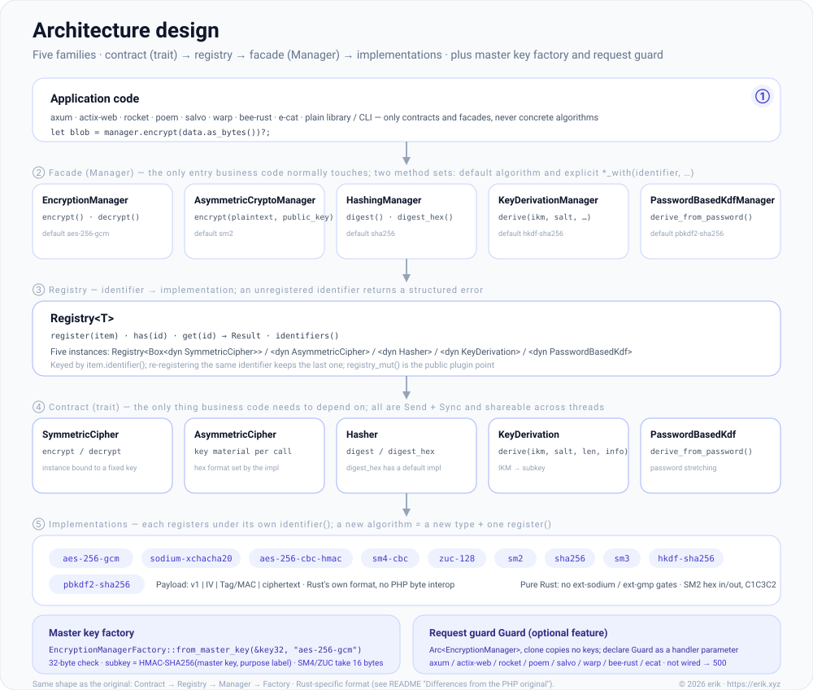
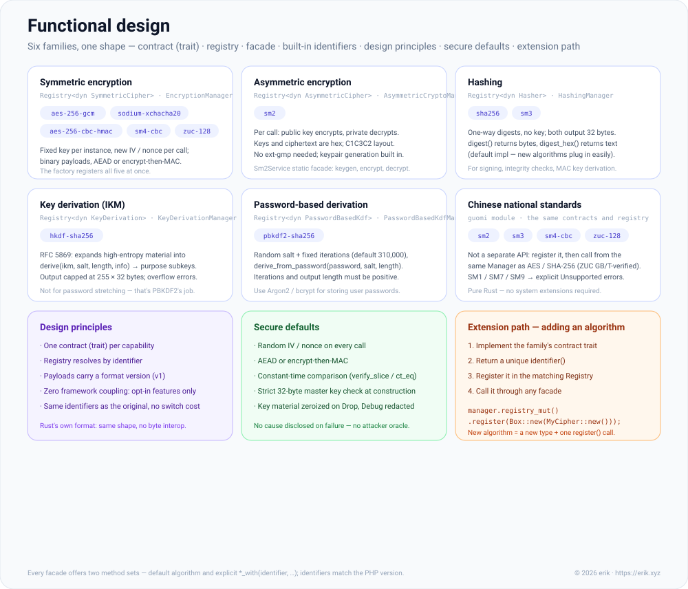
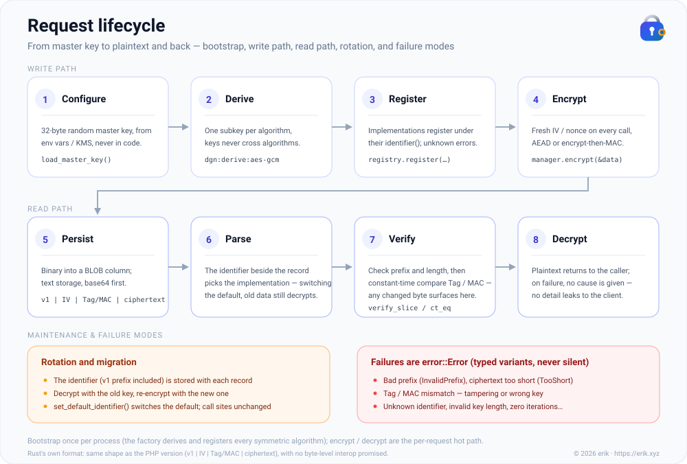

<!-- Copyright (c) 2026 erik <erik@erik.xyz> — https://erik.xyz -->

# encryption-rust

[](https://crates.io/crates/encryption-rust)
[](https://docs.rs/encryption-rust)
[](https://github.com/erikwang2013/encryption-rust/actions/workflows/ci.yml)
[](../../../LICENSE)

**Languages:** [简体中文](../../../README.md) | **English**

<p align="center">
  
</p>

A pluggable cryptography component library: under a unified set of contracts it provides **symmetric encryption**, **asymmetric encryption**, **hashing**, and **key derivation** (HKDF / PBKDF2), with implementations covering AES/Sodium and the Chinese national standards SM2/SM3/SM4/ZUC — installed through Cargo.

**Locky** is the little padlock above, and this project's pet: every algorithm holds its own subkey, every encryption uses a fresh IV, and the keyhole never gives away a secret. Host projects can show it too: `pet::SVG` returns the SVG markup (ready to inline into HTML), `pet::ASCII` returns a terminal banner, and `pet::NAME` is `Locky`.

A Rust port of the PHP package [`erikwang2013/encryption`](https://github.com/erikwang2013/encryption).

---

## Project pet: Locky


A little padlock holding a golden key. The persona is not decoration — it draws this library's design:

| Trait | Design it reflects |
|------|---------|
| The keyhole (a smile) | Key / IV discipline: the keyhole never reveals what it has seen — keys and plaintext never leak |
| The golden key in the other hand | Master key: `EncryptionManagerFactory::from_master_key` derives each algorithm's subkey from it |
| A lock opens only for its own key | Authenticated encryption: if GCM / encrypt-then-MAC fails to decrypt, the key is wrong or the ciphertext was tampered with — there is no third explanation |
| One subkey per algorithm | Under one master key, AES and SM4/ZUC share no key material, avoiding key reuse |

Motto: **the keyhole never gives away a secret.**

The artwork is compiled into the library with `include_str!` ([`src/pet.rs`](../../../src/pet.rs) — zero runtime cost, not linked unless used), and `pet::ASCII` can go straight into a terminal or a log:

```rust
use encryption::pet;

println!("{}", pet::ASCII);

//      .-------.
//      /       \
//   .-------------.
//   |  o       o  |
//   |             |
//   |     ,-.     |
//   |    (   )    |
//   |     '-'     |
//   |      |      |
//   '-------------'
```

Four constants are public — `pet::NAME` / `pet::TAGLINE` / `pet::ASCII` / `pet::SVG` — shared by the README, CLI banners, and downstream admin UIs.

The pet lives beyond the README too: **each of the three design diagrams carries a small Locky icon in its top-right corner** (fully inline SVG, so it renders directly on GitHub), and [`social-preview.svg`](../../social-preview.svg) / `social-preview.png` is the pet's key visual for GitHub's repository social preview (1280×640 — upload it in the repository settings).

`docs/pet.svg` **must not** go into Cargo's `exclude` — `include_str!` reads it at compile time, so excluding it fails the build on the spot (`cargo package` errors out rather than silently shipping without it).

---

## About the project

### What it is

`encryption-rust` is a pure-Rust cryptography component library that gives Rust applications **type-safe, extensible** encryption, decryption, hashing, and key derivation. It is coupled to no framework: use it inside web frameworks such as axum or actix-web, or standalone in a plain library or CLI project.

### What it solves

Cryptographic building blocks in the Rust ecosystem have long been scattered: AES via `aes-gcm`, stream ciphers via `chacha20poly1305`, the Chinese national standards spread across separate crates (sm2 / sm3 / sm4 / zuc), and no unified interface for HKDF / PBKDF2. This library gathers the mainstream symmetric / asymmetric / hash / KDF algorithms under a **single contract system**, so that:

- **business code only ever faces interfaces** — switching algorithms does not change business code
- **the Chinese national standards get equal treatment with AES/Sodium** — once registered, they are called through the same Manager
- **key management is normalized**: one call derives each algorithm's subkey from the master key, avoiding key reuse
- **secure defaults**: authenticated encryption (GCM / encrypt-then-MAC), random IVs, constant-time comparison, and more — out of the box

### Use cases

- Field-level encryption (encrypt phone numbers, ID numbers, and other sensitive fields before they hit the database)
- Running several algorithms side by side and migrating smoothly (e.g. from AES-256-CBC to AES-256-GCM)
- Back-office systems that require Chinese national standard (Guomi) compliance (SM2 asymmetric, SM3 hash, SM4 symmetric, ZUC stream cipher)
- API signing and verification (HMAC / SHA-256 / SM3)
- Subkey derivation from a password or master key (PBKDF2 / HKDF)

---

## Features

- **Eight capability families, one shape**: symmetric encryption / asymmetric encryption / hashing / key derivation / password-based derivation / signatures / key agreement / key encapsulation — each family follows the same contract (trait) → registry (Registry) → facade (Manager) pattern, so learning one family means learning them all.
- **Ten identifiers out of the box**: `aes-256-gcm`, `sodium-xchacha20`, `aes-256-cbc-hmac`, `sm4-cbc`, `zuc-128`, `sm2`, `sha256`, `sm3`, `hkdf-sha256`, `pbkdf2-sha256` (identical to the PHP version's identifiers — migrating costs zero renames).
- **Extended algorithm surface (1.2.0)**: beyond the factory defaults there are 30+ more identifiers — 9 symmetric, 8 hashes, 2 password KDFs, 1 asymmetric cipher, 5 signatures (including SM2 signing), 4 key-agreement, 3 key-encapsulation (post-quantum ML-KEM); all registered manually, leaving the factory and the PHP alignment surface untouched.
- **Master key factory**: `EncryptionManagerFactory::from_master_key` — one 32-byte master key derives an independent subkey per algorithm from purpose labels, assembling every algorithm in one go and ruling out key reuse.
- **Request guard + framework adapters**: native Rust plus 8 opt-in features for axum / actix-web / rocket / poem / salvo / warp / bee-rust / e-cat; declare `Guard` as a handler parameter and encrypt/decrypt right there.
- **Chinese national standards as first-class citizens**: SM2 / SM3 / SM4 / ZUC go through the same register-and-facade path as AES / SHA; SM1 / SM7 / SM9 return an explicit error rather than staying silent.
- **Secure defaults**: random IV / nonce, AEAD or encrypt-then-MAC, constant-time comparison, key material zeroized on Drop, Debug redaction, and no reason disclosed on decryption failure.
- **Pure Rust, zero extension dependencies**: no `ext-sodium` / `ext-gmp`-style prerequisites; ZUC is validated against the GB/T 33133.1 standard test vectors.
- **Docs as design diagrams**: three SVGs — architecture design / functional design / request lifecycle (one set in Chinese, one in English) — plus the pet Locky.
- **Zero framework coupling**: the core library depends on no web framework; every framework integration is optional and none is pulled in by default.

> For the full capability map see [Functional design](#functional-design) below; for the layered structure see [Architecture overview](#architecture-overview).

## Table of contents

- [Installation](#installation)
- [Quick start](#quick-start)
- [Architecture overview](#architecture-overview)
- [Functional design](#functional-design)
- [Request lifecycle](#request-lifecycle)
- [Built-in algorithms and identifiers](#built-in-algorithms-and-identifiers)
- [Usage](#usage)
- [Framework integration (optional features)](#framework-integration-optional-features)
- [Differences from the PHP original](#differences-from-the-php-original)
- [Project layout](#project-layout)
- [FAQ](#faq)
- [Security recommendations](#security-recommendations)
- [Running tests](#running-tests)
- [Reference original project](#reference-original-project)
- [License](#license)

---

## Installation

```bash
cargo add encryption-rust
```

```toml
[dependencies]
encryption-rust = "1.0"
```

## Quick start

```rust
use encryption::factory::EncryptionManagerFactory;

// In production, read a random 32-byte master key from an environment variable / KMS and back it up properly.
let master_key: [u8; 32] = load_master_key();
let manager = EncryptionManagerFactory::from_master_key(&master_key, "aes-256-gcm")?;

// Field-level encryption: the ciphertext is binary; base64 / hex it yourself for TEXT columns.
let stored = manager.encrypt(phone.as_bytes())?;
let phone = manager.decrypt(&stored)?;
```

A complete runnable version lives in [`examples/quickstart.rs`](../../../examples/quickstart.rs): `cargo run --example quickstart` prints the pet ASCII art and walks the full round trip — encrypt → encode → decrypt → tamper detection.

## Architecture overview



Source file: [`architecture-design.svg`](./architecture-design.svg)

Capabilities are split into eight groups of contracts, each with the same contract (trait) → registry (Registry) → facade (Manager) shape; `EncryptionManagerFactory` derives every subkey from one master key and assembles the symmetric registry.

| Capability | Contract (trait) | Registry | Facade (default algorithm) |
|------|--------------|--------|------------------|
| Symmetric encryption | `SymmetricCipher` | `Registry<Box<dyn SymmetricCipher>>` | `EncryptionManager` (`aes-256-gcm`) |
| Asymmetric encryption | `AsymmetricCipher` | `Registry<Box<dyn AsymmetricCipher>>` | `AsymmetricCryptoManager` (`sm2`) |
| Hashing | `Hasher` | `Registry<Box<dyn Hasher>>` | `HashingManager` (`sha256`) |
| Key derivation (IKM) | `KeyDerivation` | `Registry<Box<dyn KeyDerivation>>` | `KeyDerivationManager` (`hkdf-sha256`) |
| Password-based derivation | `PasswordBasedKdf` | `Registry<Box<dyn PasswordBasedKdf>>` | `PasswordBasedKdfManager` (`pbkdf2-sha256`) |
| Signatures | `Signer` | `Registry<Box<dyn Signer>>` | `SignatureManager` (default identifier passed to the constructor, e.g. `ed25519`) |
| Key agreement | `KeyAgreement` | `Registry<Box<dyn KeyAgreement>>` | `KeyAgreementManager` (e.g. `x25519`) |
| Key encapsulation | `KeyEncapsulation` | `Registry<Box<dyn KeyEncapsulation>>` | `KeyEncapsulationManager` (e.g. `ml-kem-768`) |

- **Symmetric**: an instance is bound to a fixed key; payloads are binary, well suited to field-level bulk encryption.
- **Asymmetric**: key material is passed in on every call (hexadecimal; the format is agreed by the implementation, e.g. SM2).
- **Hashing**: one-way digest, keyless; `digest` returns bytes, `digest_hex` returns hexadecimal.
- **Key derivation**: HKDF expands high-entropy material into subkeys; PBKDF2 stretches human passwords (random salt + a high iteration count).
- **Subkeys**: `HMAC-SHA256(key = master key, msg = purpose label)`; SM4 / ZUC take the first 16 bytes.
- **All eight contracts are `Send + Sync`**: implementations can be shared across threads, which is what lets the request guard clone with zero key copies.
- **Signatures / agreement / encapsulation**: keys and results are hexadecimal strings; ML-KEM decapsulation of a tampered ciphertext follows FIPS 203 implicit rejection — no error is raised, and a different pseudorandom key is returned.

## Functional design



Source file: [`functional-design.svg`](./functional-design.svg)

| Capability family | Facade | Identifiers shipped with the crate |
|--------|------|---------------------|
| Symmetric encryption | `EncryptionManager` | 5 factory defaults: `aes-256-gcm` / `sodium-xchacha20` / `aes-256-cbc-hmac` / `sm4-cbc` / `zuc-128`; 9 extensions: `chacha20-poly1305-ietf` / `aes-256-gcm-siv` / `camellia-256-cbc-hmac` / `aria-256-cbc-hmac` / `threefish-512-cbc-hmac` / `kuznyechik-256-cbc-hmac` / `salsa20` / `sm4-gcm` / `zuc-256` |
| Asymmetric encryption | `AsymmetricCryptoManager` | `sm2` (plus the static facade `Sm2Service`); extension: `rsa-oaep-sha256` |
| Hashing | `HashingManager` | `sha256` / `sm3`; extensions: `sha3-256` / `sha3-512` / `blake2b-512` / `blake2s-256` / `blake3` / `streebog-256` / `streebog-512` / `belt-hash` |
| Key derivation (IKM) | `KeyDerivationManager` | `hkdf-sha256` (RFC 5869) |
| Password-based derivation | `PasswordBasedKdfManager` | `pbkdf2-sha256` (310,000 iterations by default); extensions: `argon2` / `scrypt` |
| Signatures | `SignatureManager` | `sm2` (signing capability) / `ed25519` / `ecdsa-p256-sha256` / `ecdsa-p384-sha384` / `ecdsa-secp256k1-sha256` |
| Key agreement | `KeyAgreementManager` | `x25519` / `ecdh-p256` / `ecdh-p384` / `ecdh-secp256k1` |
| Key encapsulation (post-quantum) | `KeyEncapsulationManager` | `ml-kem-512` / `ml-kem-768` / `ml-kem-1024` (FIPS 203) |
| Chinese national standards | the facades above | `sm2` (encryption + signing) / `sm3` / `sm4-cbc` / `zuc-128`; extensions `sm4-gcm` / `zuc-256`; SM1 / SM7 / SM9 → explicit error |

Design principles, secure defaults, and the four-step path for "adding an algorithm" are the three blocks on the right of the diagram above; per-algorithm details (key length, payload structure) are under [Built-in algorithms and identifiers](#built-in-algorithms-and-identifiers) below.

## Request lifecycle



Source file: [`lifecycle.svg`](./lifecycle.svg)

Write path (bootstrapped once per process; the encrypt / decrypt calls that follow are the per-request hot path):

1. **Configure**: the 32-byte random master key comes from an environment variable / KMS and never goes into code;
2. **Derive**: the factory derives a subkey per algorithm from purpose labels; a key is never reused across algorithms;
3. **Register**: each implementation registers under its own `identifier()`, and an unknown identifier errors out explicitly;
4. **Encrypt**: every call generates a fresh random IV / nonce, and authenticated encryption or encrypt-then-MAC packs the record as `v1 | IV | Tag/MAC | ciphertext`.

Read path:

5. **Persist**: binary goes into a BLOB column; for text storage, convert to base64 first;
6. **Parse**: the identifier stored alongside the record decides which implementation to use — after switching the default algorithm, old data still decrypts as usual;
7. **Verify**: check the prefix and length first, then compare the Tag / MAC in constant time; any modified byte is caught right here;
8. **Decrypt**: the plaintext goes back to the caller; on failure no reason is distinguished and no detail leaks to the client.

Key rotation, migration, and every failure variant are in the "Maintenance & failure modes" block at the bottom of the diagram.

## Built-in algorithms and identifiers

### Symmetric encryption (`SymmetricCipher`)

| Identifier | Type | Key length | Payload |
|------|------|----------|------|
| `aes-256-gcm` | `Aes256GcmEncryptor` | 32 bytes | `v1 \| IV(12) \| Tag(16) \| ciphertext`, AES-GCM authenticated encryption, the recommended default |
| `sodium-xchacha20` | `SodiumXChaCha20Encryptor` | 32 bytes | `v1 \| Nonce(24) \| ciphertext‖Tag(16)`, XChaCha20-Poly1305, pure Rust, always available |
| `aes-256-cbc-hmac` | `Aes256CbcEncryptor` | 32 bytes | `v1 \| IV(16) \| MAC(32) \| ciphertext`, CBC + HMAC, compatible with legacy environments |
| `sm4-cbc` | `Sm4CbcEncryptor` | 16 bytes | the same CBC-HMAC structure, Chinese national standard SM4 |
| `zuc-128` | `Zuc128Encryptor` | 16 bytes | the same CBC-HMAC structure, ZUC-128 stream cipher XORed with the keystream |
| `chacha20-poly1305-ietf` | `ChaCha20Poly1305IetfEncryptor` | 32 bytes | `v1 \| Nonce(12) \| Tag(16) \| ciphertext`, IETF ChaCha20-Poly1305 (RFC 8439), no AES hardware needed |
| `aes-256-gcm-siv` | `Aes256GcmSivEncryptor` | 32 bytes | same frame layout, AES-256-GCM-SIV (RFC 8452) misuse-resistant AEAD, nonce reuse is not fatal |
| `camellia-256-cbc-hmac` | `Camellia256CbcEncryptor` | 32 bytes | the same CBC-HMAC structure, Camellia-256 (ISO/IEC 18033-3) |
| `aria-256-cbc-hmac` | `Aria256CbcEncryptor` | 32 bytes | the same CBC-HMAC structure, ARIA-256 (RFC 5794) |
| `threefish-512-cbc-hmac` | `Threefish512CbcEncryptor` | 64 bytes | `v1 \| IV(64) \| MAC(32) \| ciphertext`, Threefish-512 (64-byte blocks and IV) |
| `kuznyechik-256-cbc-hmac` | `Kuznyechik256CbcEncryptor` | 32 bytes | the same CBC-HMAC structure, Kuznyechik (GOST R 34.12-2015, fixed 256-bit key) |
| `salsa20` | `Salsa20Encryptor` | 32 bytes | `v1 \| Nonce(8) \| MAC(32) \| ciphertext`, Salsa20/20 stream cipher XORed with the keystream |
| `sm4-gcm` | `Sm4GcmEncryptor` | 16 bytes | `v1 \| Nonce(12) \| Tag(16) \| ciphertext`, SM4 + GCM assembled in-crate (anchored by RFC 8998 vectors) |
| `zuc-256` | `Zuc256Encryptor` | 32 bytes | `v1 \| IV(23) \| MAC(32) \| ciphertext`, ZUC-256 stream cipher (32-byte key / 23-byte IV) |

> The first five rows are registered by the master key factory; the rest are extensions from this release (registered manually, not part of the factory).

### Asymmetric encryption (`AsymmetricCipher`)

| Identifier | Type | Notes |
|------|------|------|
| `sm2` | `Sm2AsymmetricCipher` / `Sm2Service` | Chinese national standard SM2; keys and ciphertext are hexadecimal, ciphertext layout C1C3C2 |
| `rsa-oaep-sha256` | `RsaOaepSha256Cipher` | RSAES-OAEP (digest and MGF1 both SHA-256); private key = PKCS#8 DER, public key = SPKI DER, hex-encoded; `generate_key_pair_hex` refuses < 2048 bits |

### Hashing (`Hasher`)

| Identifier | Type | Output size |
|------|------|----------|
| `sha256` | `Sha256Hasher` | 32 bytes |
| `sm3` | `Sm3Hasher` | 32 bytes |
| `sha3-256` | `Sha3_256Hasher` | 32 bytes |
| `sha3-512` | `Sha3_512Hasher` | 64 bytes |
| `blake2b-512` | `Blake2b512Hasher` | 64 bytes |
| `blake2s-256` | `Blake2s256Hasher` | 32 bytes |
| `blake3` | `Blake3Hasher` | 32 bytes (default output; BLAKE3 supports extended output, this library uses the default length) |
| `streebog-256` | `Streebog256Hasher` | 32 bytes |
| `streebog-512` | `Streebog512Hasher` | 64 bytes |
| `belt-hash` | `BeltHashHasher` | 32 bytes |

### Key derivation

| Identifier | Type | Contract | Notes |
|------|------|------|------|
| `hkdf-sha256` | `HkdfSha256` | `KeyDerivation` | RFC 5869, based on IKM + salt + info |
| `pbkdf2-sha256` | `Pbkdf2Sha256` | `PasswordBasedKdf` | password + salt + iteration count (310,000 by default, adjustable through the constructor) |
| `argon2` | `Argon2Kdf` | `PasswordBasedKdf` | Argon2id v19; defaults m=19456 KiB (~19 MiB) / t=2 / p=1, adjustable via `with_params` |
| `scrypt` | `ScryptKdf` | `PasswordBasedKdf` | defaults log_n=17, r=8, p=1 (~128 MiB per derivation — mind the DoS surface in web contexts, adjustable via `with_params`) |

### Signatures (`Signer`)

| Identifier | Type | Notes |
|------|------|------|
| `sm2` | `Sm2Signer` | SM2 sign / verify; ZA default user ID `1234567812345678` (GM/T 0003.2) — **verifiers must use the same ID** |
| `ed25519` | `Ed25519Signer` | RFC 8032; 32-byte seed private key, fixed 64-byte signature |
| `ecdsa-p256-sha256` | `EcdsaP256Signer` | RFC 6979 deterministic signatures; raw-scalar private key hex, SEC1 uncompressed `04‖X‖Y` public key, fixed-size `r‖s` signature |
| `ecdsa-p384-sha384` | `EcdsaP384Signer` | same (P-384 / SHA-384, 96-byte signatures) |
| `ecdsa-secp256k1-sha256` | `EcdsaSecp256k1Signer` | same (secp256k1; RFC 6979 publishes no vectors for this curve, so its KAT degrades to behavioral tests) |

### Key agreement (`KeyAgreement`)

| Identifier | Type | Notes |
|------|------|------|
| `x25519` | `X25519Agreement` | RFC 7748; rejects the all-zero shared secret produced by small-order points |
| `ecdh-p256` / `ecdh-p384` / `ecdh-secp256k1` | `EcdhP256` / `EcdhP384` / `EcdhSecp256k1` | static ECDH; the shared secret is the raw x-coordinate in hex |

### Key encapsulation (`KeyEncapsulation`, post-quantum)

| Identifier | Type | Public key ek | Private key dk | Ciphertext ct |
|------|------|---------|---------|---------|
| `ml-kem-512` | `MlKem512Kem` | 800 bytes | 1632 bytes | 768 bytes |
| `ml-kem-768` | `MlKem768Kem` | 1184 bytes | 2400 bytes | 1088 bytes |
| `ml-kem-1024` | `MlKem1024Kem` | 1568 bytes | 3168 bytes | 1568 bytes |

FIPS 203 (ML-KEM) key encapsulation: encapsulating with the public key yields `(ciphertext, shared secret)` (32-byte shared secret), decapsulating with the private key yields the shared secret; everything is hex-encoded. A tampered ciphertext or a mismatched private key follows the standard **implicit rejection** semantics: no error is raised, and a different pseudorandom key is returned.

SM1, SM7, and SM9 have no implementation: calling `guomi::unavailable::sm1()` and friends returns an explicit `UnsupportedNationalAlgorithm` error, so business code can catch it uniformly or wire in a vendor SDK / HSM.

## Usage

### 1. Symmetric encryption: a single algorithm and the registry

```rust
use encryption::encryptor::Aes256GcmEncryptor;
use encryption::manager::EncryptionManager;
use encryption::registry::Registry;
use encryption::contract::SymmetricCipher;

// single algorithm
let key = [7u8; 32];
let encryptor = Aes256GcmEncryptor::new(key);
let blob = encryptor.encrypt(b"\xe6\x98\x8e\xe6\x96\x87")?;
let plaintext = encryptor.decrypt(&blob)?;

// registry + facade
let mut registry = Registry::new("symmetric cipher");
registry.register(Box::new(encryptor));
let manager = EncryptionManager::new(registry, "aes-256-gcm")?;
let blob = manager.encrypt(b"\xe6\x95\xb0\xe6\x8d\xae")?;
```

Master key factory: `EncryptionManagerFactory::from_master_key(&master_key32, "aes-256-gcm")` registers all five algorithms — **aes-256-gcm**, **aes-256-cbc-hmac**, **sodium-xchacha20**, **sm4-cbc**, **zuc-128** — each of them using an independent subkey derived from a purpose label.

### 2. Asymmetric encryption (SM2)

```rust
use encryption::guomi::{Sm2AsymmetricCipher, Sm2Service};
use encryption::manager::AsymmetricCryptoManager;
use encryption::registry::Registry;

let pair = Sm2Service::generate_key_pair_hex()?;   // private key: 64 hex chars; public key: 130 hex chars (04‖X‖Y)

let cipher = Sm2AsymmetricCipher::new();
let ciphertext_hex = cipher.encrypt(b"\xe6\x98\x8e\xe6\x96\x87", &pair.public_key_hex)?;
let plaintext = cipher.decrypt(&ciphertext_hex, &pair.private_key_hex)?;

let mut registry = Registry::new("asymmetric cipher");
registry.register(Box::new(cipher));
let manager = AsymmetricCryptoManager::new(registry, "sm2")?;
let ciphertext_hex = manager.encrypt(b"\xe6\x98\x8e\xe6\x96\x87", &pair.public_key_hex)?;
```

Public keys are accepted in three hexadecimal forms: 130 digits (`04‖X‖Y`), 128 digits (`X‖Y`, with `04` prepended automatically), and 66 digits (compressed point).

### 3. Hashing

```rust
use encryption::guomi::Sm3Hasher;
use encryption::hash::Sha256Hasher;
use encryption::manager::HashingManager;
use encryption::registry::Registry;

let mut registry = Registry::new("hasher");
registry.register(Box::new(Sha256Hasher::new()));
registry.register(Box::new(Sm3Hasher::new()));

let hashing = HashingManager::new(registry, "sha256")?;
let digest = hashing.digest(b"\xe6\x95\xb0\xe6\x8d\xae")?;         // 32 bytes
let hex = hashing.digest_hex_with("sm3", b"\xe6\x95\xb0\xe6\x8d\xae")?; // hexadecimal
```

### 4. Key derivation (HKDF / PBKDF2)

```rust
use encryption::kdf::{HkdfSha256, Pbkdf2Sha256};
use encryption::manager::{KeyDerivationManager, PasswordBasedKdfManager};
use encryption::registry::Registry;

// Derive a subkey from high-entropy material (e.g. a subkey for envelope encryption)
let hkdf = HkdfSha256::new();
let sub_key = hkdf.derive(&ikm32, &salt, 32, b"app:v1")?;

let mut registry = Registry::new("key derivation");
registry.register(Box::new(hkdf));
let kdf = KeyDerivationManager::new(registry, "hkdf-sha256")?;

// Derive a key from a user password (use a dedicated API such as Argon2 for storing password hashes)
let pbkdf2 = Pbkdf2Sha256::with_default_iterations();   // 310,000 iterations, adjustable via new(n)
let derived = pbkdf2.derive_from_password(b"\xe5\x8f\xa3\xe4\xbb\xa4", &salt16, 32)?;

let mut registry = Registry::new("password-based kdf");
registry.register(Box::new(pbkdf2));
let pwd = PasswordBasedKdfManager::new(registry, "pbkdf2-sha256")?;
```

### 5. Chinese national standards (SM3 / SM4 / ZUC / SM2)

```rust
use encryption::guomi::{Sm2Service, Sm3Hasher, Sm4CbcEncryptor, Zuc128Encryptor};
use encryption::contract::{Hasher, SymmetricCipher};

let digest = Sm3Hasher::new().digest(b"\xe6\x95\xb0\xe6\x8d\xae")?;

let sm4 = Sm4CbcEncryptor::new([1u8; 16]);
let blob = sm4.encrypt(b"\xe6\x98\x8e\xe6\x96\x87")?;

let zuc = Zuc128Encryptor::new([2u8; 16]);
let blob = zuc.encrypt(b"\xe6\x98\x8e\xe6\x96\x87")?;

// For SM2 see the asymmetric example above.
```

### 6. Custom plugins

Implement the matching contract and register it — everything else (facade, default-algorithm switching, error semantics) is reused as is:

- Symmetric: implement `SymmetricCipher` and register it in the symmetric registry;
- Asymmetric: implement `AsymmetricCipher` and register it in the asymmetric registry;
- Hashing: implement `Hasher` (only `digest` is required; `digest_hex` has a default implementation);
- KDF: implement `KeyDerivation` or `PasswordBasedKdf` and register it in the matching registry.

```rust
use encryption::contract::{Identified, SymmetricCipher};
use encryption::error::Result;

struct MyCipher { /* ... */ }

impl Identified for MyCipher {
    fn identifier(&self) -> &str { "my-cipher" }
}

impl SymmetricCipher for MyCipher {
    fn encrypt(&self, plaintext: &[u8]) -> Result<Vec<u8>> { /* ... */ Ok(plaintext.to_vec()) }
    fn decrypt(&self, ciphertext: &[u8]) -> Result<Vec<u8>> { Ok(ciphertext.to_vec()) }
}

manager.registry_mut().register(Box::new(MyCipher { /* ... */ }));
```

### 7. Error handling

On failure the library returns `encryption::error::Error`, with the same stance as the PHP version: a decryption failure is always "wrong key or tampered ciphertext", and no reason is distinguished. Catch and log it in business code, and **do not** pass error details through to the frontend.

```rust
match manager.decrypt(&stored) {
    Ok(plaintext) => { /* ... */ }
    Err(error) => log::warn!("decryption failed: {error}"),
}
```

### 8. Extended algorithms: signatures / key agreement / post-quantum KEM

Extensions are not part of the master key factory (the factory defaults and the PHP alignment surface stay unchanged); wire them onto a registry yourself. Keys, signatures, ciphertexts, and shared secrets are all hexadecimal strings. See the module docs for every extension (`encryption::encryptor` / `hash` / `kdf` / `asymmetric` / `pqc` / `guomi`).

```rust
use encryption::asymmetric::Ed25519Signer;
use encryption::contract::Signer;
use encryption::manager::SignatureManager;
use encryption::registry::Registry;

// Manual assembly (Ed25519 shown; SM2 signing is the same Signer contract)
let mut registry: Registry<Box<dyn Signer>> = Registry::new("signer");
registry.register(Box::new(Ed25519Signer::new()));
let manager = SignatureManager::new(registry, "ed25519")?;

let pair = Ed25519Signer::generate_key_pair_hex()?;
let signature = manager.sign(b"message", &pair.private_key_hex)?;
manager.verify(b"message", &signature, &pair.public_key_hex)?; // failure → VerificationFailed, no cause disclosed
```

```rust
use encryption::asymmetric::X25519Agreement;
use encryption::contract::KeyAgreement;

// Key agreement: both sides derive the same shared secret from (own private key, peer public key)
let alice = X25519Agreement::generate_key_pair_hex()?;
let bob = X25519Agreement::generate_key_pair_hex()?;
let sender = X25519Agreement::new().agree(&alice.private_key_hex, &bob.public_key_hex)?;
let receiver = X25519Agreement::new().agree(&bob.private_key_hex, &alice.public_key_hex)?;
assert_eq!(sender, receiver);
```

```rust
use encryption::contract::KeyEncapsulation;
use encryption::pqc::MlKem768Kem;

// Post-quantum: ML-KEM key encapsulation (FIPS 203)
let kem = MlKem768Kem::new();
let (ek_hex, dk_hex) = kem.generate()?;               // (public key, private key)
let (ct_hex, secret_hex) = kem.encapsulate(&ek_hex)?; // (ciphertext, shared secret)
assert_eq!(kem.decapsulate(&ct_hex, &dk_hex)?, secret_hex);
// On a tampered ciphertext: no error, a different pseudorandom key is returned (implicit rejection, per the standard)
```

## Framework integration (optional features)

[`Guard`](../../../src/guard.rs) is a framework-agnostic request guard: internally it is an `Arc<EncryptionManager>`, so cloning it just bumps a reference count and **copies no key material**. One opt-in feature per framework; a default build pulls in none of them.

The guard can also be built straight from environment variables: `ENCRYPTION_MASTER_KEY` accepts explicit `hex:` / `base64:` prefixes — without a prefix, a 64-character hex string is treated as hex and anything else as base64 (the decoded value must be exactly 32 bytes). `ENCRYPTION_ALGORITHM` is optional and defaults to `aes-256-gcm`.

```rust
use encryption::guard::Guard;

let guard = Guard::from_env()?;   // reads ENCRYPTION_MASTER_KEY / ENCRYPTION_ALGORITHM
// Tests or custom config sources: Guard::from_env_with(|key| my_config.get(key).cloned())
```

| feature | Integration |
|---------|---------|
| (native Rust) | `Guard::from_master_key(&key, "aes-256-gcm")`; put it into whatever state container you like |
| `axum` | implements `FromRequestParts`: declare `Guard` as a handler parameter |
| `actix-web` | implements `FromRequest`: register `web::Data::new(guard)` and declare `Guard` as a handler parameter |
| `rocket` | implements `FromRequest` (request guard): `manage(guard)` and declare `Guard` as a handler parameter |
| `poem` | implements `FromRequest`: `.data(guard)` and declare `Guard` as a handler parameter |
| `salvo` | implements `Extractible`: `affix_state::inject(guard)` and declare `Guard` as a handler parameter |
| `warp` | the `with_guard(guard)` combinator plugs into the filter chain |
| `bee-rust` | bee-rust's `Router` takes axum handlers directly, reusing the axum adapter (module: `integrations::bee_rust`) |
| `ecat` | `GuardLayer` (a tower Layer/Service) injects the Guard into request extensions |

A real application's state struct holds more than one encryptor. Make the state implement `Guarded` (just point at the field holding the guard) and every framework's extraction logic can be reused:

```rust
use std::sync::Arc;
use encryption::guard::Guard;
use encryption::integrations::Guarded;

#[derive(Clone)]
struct AppState {
    pool: Arc<()>,          // your connection pool, config, …
    encryption: Guard,      // the encryption guard
}

impl Guarded for AppState {
    fn guard(&self) -> &Guard { &self.encryption }
}

// axum example: declare the guard right in the handler signature
async fn store_phone(guard: Guard) -> String {
    guard.encrypt("13800138000".as_bytes()).unwrap_or_default().len().to_string()
}
```

Forgetting to wire it up (a missing `manage` / `app_data` / `with_state` / `.data(...)`) yields an explicit **500** (a server-side wiring error) — not a panic, and not a 4xx. How to respond to an encryption failure is the handler's call — this library does not decide for your app whether a failed decryption should return 500 or 422.

```bash
cargo add encryption-rust --features axum   # or actix-web / rocket / poem / salvo / warp / bee-rust / ecat
```

## Differences from the PHP original

This library follows the architecture and identifier design of the PHP version [`erikwang2013/encryption`](https://github.com/erikwang2013/encryption), but uses a **Rust-specific format**:

1. Ciphertext is **not interoperable** with the PHP version: the structure keeps the `v1 | IV | Tag/MAC | ciphertext` shape, but there is no byte-level cross-decryption guarantee, and no cross-decryption tests have been run.
2. Only the corrected subkey derivation is used (the HMAC key is the master key and the message is the purpose label); the original's legacy reversed-order v1 scheme is not reproduced.
3. No extension dependencies: Sodium XChaCha20 is a pure-Rust implementation, always available (the original needs `ext-sodium`); SM2 has no `ext-gmp` prerequisite.
4. SM2 ciphertext / key encoding follows the RustCrypto `sm2` standard (C1C3C2, uncompressed C1) and is not aligned with the original's pohoc/crypto-sm layout.
5. Framework adapters are rewritten for the Rust ecosystem: native Rust (the `Guard` request guard) plus axum / actix-web / rocket / poem / salvo / warp / bee-rust / e-cat, corresponding to the original's Laravel / ThinkPHP / Hyperf / webman integrations.
6. Since 1.2.0 there is an extension surface beyond the PHP version: symmetric ciphers (IETF ChaCha20-Poly1305 / AES-GCM-SIV / Camellia / ARIA / Threefish / Kuznyechik / Salsa20), hashes (SHA-3 / BLAKE2 / BLAKE3 / Streebog / Belt-Hash), password KDFs (Argon2id / scrypt), RSA-OAEP, ECDSA / Ed25519 / X25519 / ECDH, post-quantum ML-KEM, and three new contracts (`Signer` / `KeyAgreement` / `KeyEncapsulation`) — none of which exist in the PHP version; their identifiers, key formats, and frame layouts are defined by this library.

## Project layout

```text
encryption-rust/
├── src/
│   ├── lib.rs                 crate docs and module exports
│   ├── contract.rs            the eight capability contracts (traits) and Identified
│   ├── registry.rs            the generic registry Registry<T>
│   ├── manager.rs             six facades: Encryption / Asymmetric / Hashing / KeyDerivation / PasswordBasedKdf / KeyEncapsulation
│   │   └── manager/asymmetric.rs  two more facades: Signature / KeyAgreement
│   ├── factory.rs             master key factory: subkey derivation and registry assembly
│   ├── guard.rs               request guard Guard (Arc<EncryptionManager>, framework-agnostic)
│   ├── integrations/          8 framework adapters (each behind its own feature)
│   │                          axum / actix / rocket / poem / salvo / warp / bee_rust / ecat
│   ├── key.rs                 fixed-length key material Key<N> (zeroized on Drop, redacted Debug)
│   ├── error.rs               Error / Result
│   ├── asymmetric/            rsa / ecdsa / ecdh / ed25519 / x25519 (KeyPairHex unified here)
│   ├── encryptor/             aes256gcm / aes256cbc / sodium_xchacha20 / chacha20poly1305_ietf / aes256gcm_siv / camellia256cbc / aria256cbc / threefish512cbc / kuznyechikcbc / salsa20
│   ├── hash/                  sha256 / sha3 / blake2 / blake3 / streebog / belt
│   ├── kdf/                   hkdf_sha256 / pbkdf2_sha256 / argon2 / scrypt
│   ├── pqc/                   ml_kem (FIPS 203 post-quantum KEM)
│   ├── guomi/                 sm2 (encryption + signing) / sm3 / sm4 / sm4_gcm / zuc / zuc256 / unavailable (SM1/SM7/SM9 placeholders)
│   ├── internal/              hex helpers and etm.rs (the encrypt-then-MAC shared by CBC/SM4/ZUC)
│   └── pet.rs                 project pet Locky (NAME / TAGLINE / ASCII / SVG)
├── tests/
│   ├── crypto_roundtrip.rs    end-to-end round trips for every algorithm and the five facades
│   ├── invariants.rs          cross-algorithm non-interoperability, tampering always fails, IV freshness, plugin extension
│   ├── sm2.rs                 SM2 key pairs, the facade, and error paths
│   └── known_answer.rs        cross-implementation KATs: reference ciphertexts from OpenSSL / libsodium, pinned byte for byte
├── benches/crypto_bench.rs    criterion benchmarks (wrapper vs raw aes-gcm overhead)
├── examples/quickstart.rs     zero-config quick start (encrypt → store → read → decrypt → tamper detection)
├── docs/
│   ├── pet.svg                the project pet artwork (inlined by src/pet.rs with include_str!)
│   ├── architecture-design.svg  architecture design (referenced by this README)
│   ├── functional-design.svg    functional design (referenced by this README)
│   ├── lifecycle.svg            request lifecycle (referenced by this README)
│   ├── social-preview.svg/png   GitHub social preview (pet Locky key visual; upload in repo settings)
│   └── i18n/en/               English README and the three English design diagrams
├── Cargo.toml
├── SECURITY.md
├── CHANGELOG.md
├── .github/                   CI (fmt / clippy / test / MSRV / audit) and dependabot
└── LICENSE
```

## FAQ

**Do I need to install system extensions?**
No. The whole implementation consists of pure-Rust crates: no `ext-sodium` / `ext-gmp`-style prerequisites, just `cargo build`.

**Why is the ciphertext binary?**
Consistent with the original: the library produces and accepts bytes. To store it in JSON / a TEXT column, base64- or hex-encode it yourself (see `examples/quickstart.rs`).

**Where does the master key come from?**
A 32-byte random value read from an environment variable / KMS / key service; never write it into code, never commit it to version control; **you must back it up — losing the master key means losing the data**.

**Why does the error message not distinguish the cause when decryption fails?**
A wrong key, a tampered ciphertext, and a wrong algorithm are all the same failure. Distinguishing the cause would hand attackers an oracle and leak internal details to the frontend.

**What is the SM2 ciphertext layout?**
C1C3C2 (the default layout of the current standard), with C1 an uncompressed point `04‖X‖Y`. It is not necessarily byte-for-byte identical to the original pohoc/crypto-sm hex convention (see "Differences from the PHP original").

**Are there English versions of the design diagrams?**
Yes. This English README uses the three English design diagrams under `docs/i18n/en/`; the source files use the same layouts that the Chinese README references.

## Security recommendations

- **Master key**: 32 bytes from a CSPRNG; keep it in an environment variable / KMS, never in the codebase, never in logs; back it up offline and restrict access.
- **Passwords**: use a dedicated API such as Argon2 / bcrypt to store user passwords; use PBKDF2 only to "derive an encryption key from a passphrase", and raise the iteration count for your environment.
- **Errors**: catch and log them; never pass error details through to the frontend.
- **Algorithm choice**: `aes-256-gcm` by default for new systems; the library guarantees encrypt-then-MAC for CBC / SM4-CBC — don't assemble it yourself.
- **Known boundary of RSA-OAEP**: the `rsa` crate carries an unpatched timing side-channel advisory (RUSTSEC-2023-0071, "Marvin"); this library enables blinding as a mitigation, but **for network-exposed settings prefer ECDH / X25519 / Ed25519 / ML-KEM** — treat RSA as an interop / local-use tool.
- **Randomness**: the IV / nonce is generated by the library on every encryption (system CSPRNG); never reuse one, and never bring your own.

## Running tests

```bash
cargo test                       # core library (pulls in no framework by default)
cargo test --all-features        # together with the tests for the 8 framework adapters
cargo run --example quickstart
cargo bench --bench crypto_bench # criterion: wrapper vs raw-crate overhead
```

Coverage: per-algorithm round trips and tamper-always-fails, cross-algorithm non-interoperability, factory subkey independence and validation, registry / facade behavior, SM2 key paths, the pet constants, guard extraction for every framework (including the "forgot to wire it → 500" path), and the [cross-implementation KATs](../../../tests/known_answer.rs) (reference ciphertexts produced by OpenSSL / libsodium). Extensions added in 1.2.0 carry inline official KATs (RFC 8439 / 8452 / 6979 / 8032 / 7748 / 5903 / 9106 / 7914, FIPS 202 / 203, GOST and STB standard vectors, and more).

## Reference original project

- The PHP original: [github.com/erikwang2013/encryption](https://github.com/erikwang2013/encryption)

## License

[MIT](../../../LICENSE) © 2026 erik — [https://erik.xyz](https://erik.xyz)

See [CHANGELOG.md](../../../CHANGELOG.md) for the release history.
